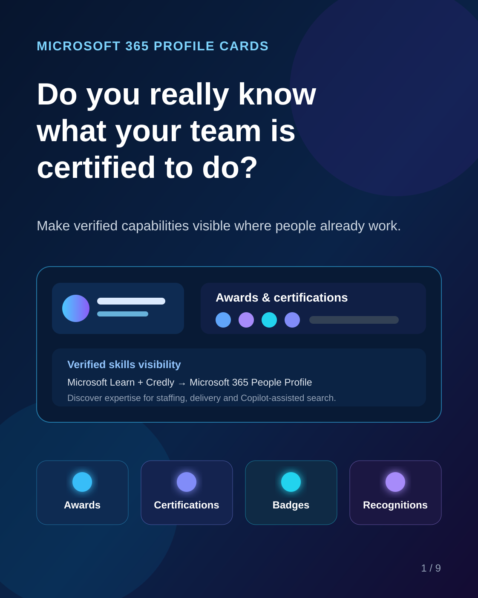
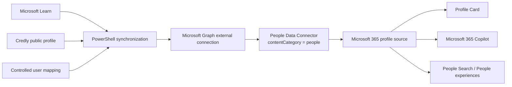

# M365 Profile Card Awards

<p align="center">
  
</p>

> Surface verified professional credentials and recognitions from Microsoft Learn and Credly in Microsoft 365 profile cards, Microsoft Search and Microsoft 365 Copilot.



## Project identity

The project uses a source-neutral brand so that Microsoft Learn, Credly and future credential providers remain data sources rather than defining the connector itself.

| Component | Name |
|---|---|
| Project | **M365 Profile Card Awards** |
| Entra application / service principal | **M365 Profile Card Awards Connector** |
| Microsoft 365 / Copilot connection | **M365 Profile Card Awards** |
| Production connection ID | `mslearncred` (preserved for compatibility) |
| Beta connection | **M365 Profile Card Awards Beta** |
| Beta connection ID | `mslearncredbeta` (preserved for isolation) |

The stable connection IDs are intentionally retained to avoid unnecessary migration of existing deployments. Branding is applied through the application display name and connection display name.

### Copilot visibility

For this solution, **Copilot Visibility should be set to On** after the connection is provisioned so that connector content can participate in Copilot Chat and search experiences. The current scripts treat this as a documented post-deployment setting rather than calling an undocumented Microsoft Graph property.

After Step 02, validate the setting in:

`Microsoft 365 admin center > Copilot > Connectors > Your connections > M365 Profile Card Awards > Copilot Visibility > On`

## Why this project exists

Microsoft 365 can display awards and certification badges directly on a user's profile card when an organization configures an appropriate profile data source. Once published, this information can also improve people discovery scenarios across Microsoft 365, including Microsoft 365 Copilot.

This project provides a PowerShell-based reference implementation that creates a **Microsoft 365 People Data Connector** and synchronizes professional credentials from:

- **Microsoft Learn** – active Microsoft certifications exposed through a shared/public Learn profile and transcript.
- **Credly** – public and accepted badges, awards and recognitions within a configurable rolling window. The default used by this project is **12 months**.

The objective is not simply to display badges. It is to build a more current, searchable inventory of demonstrated capabilities that can support staffing, service delivery, proposal preparation, internal expertise discovery and Copilot-assisted people search.

## What the solution does

The implementation:

1. Initializes a reusable local project structure and validates PowerShell prerequisites.
2. Creates a Microsoft Entra application and service principal with the Microsoft Graph application permissions required by the connector.
3. Creates and configures a Microsoft 365 People Data Connector with `contentCategory = people`.
4. Registers the connector as a Microsoft 365 profile source and configures profile source precedence.
5. Maps the connector schema to Microsoft 365 using the SchemaVersion 2.3 semantic-label contract:
   - `personAccount`
   - `personCertifications`
   - `title`
   - `url`
   - `lastModifiedBy`
   - `lastModifiedDateTime`
6. Reads enabled users from a controlled input source.
7. Retrieves active Microsoft Learn certifications and recent Credly badges.
8. Deduplicates overlapping credentials, preserves unmanaged profile entries, and optionally removes stale credentials managed by this solution.
9. Publishes source/title/update metadata together with the profile credentials and validates the external item after writing it.
10. Produces execution logs and structured synchronization reports.

## Architecture



## Repository structure

```text
.
├── README.md
├── .gitignore
├── Source/
│   ├── README.md
│   ├── 00 - Initialize-MSLearnPeopleConnector.ps1
│   ├── 01 - Create-MSLearnPeopleConnectorApp.ps1
│   ├── 02 - New-MSLearnPeopleConnector.ps1
│   └── 03 - Sync-MSLearnCredlyPeopleProfiles.ps1
├── Support/
│   ├── README.md
│   └── MSLearnPeopleConnector.sample.json
├── Docs/
│   ├── Copilot-Prompt-Library.md
│   └── Copilot-Usage-Tips.md
└── Assets/
    ├── Branding/
    │   ├── README.md
    │   ├── main/
    │   ├── beta/
    │   └── flat/
    └── Carousel/
        ├── README.md
        └── 01.svg
```

## Business value with Microsoft 365 Copilot

The value of this connector goes beyond displaying certification badges on a Microsoft 365 profile card.

Microsoft documents that People Data Connectors can enrich the people context available to Microsoft 365 Copilot, Microsoft Search, profile cards and other people experiences. In this project, that means certification and recognition data can become useful organizational context for natural-language capability discovery.

Once credentials are published consistently, Microsoft 365 Copilot can support scenarios such as:

- **Capability discovery** – find people with a specific certification, recognition, or combination of credentials.
- **Project staffing** – correlate customer requirements, Statements of Work or RFPs with certified capabilities represented in the organization.
- **Proposal support** – identify credentials that can support a technical capability statement.
- **Certification lifecycle management** – identify upcoming expirations and certification coverage that may be at risk.
- **Partner readiness** – compare certification requirements with the people who currently satisfy them and identify remaining gaps.
- **Workforce development** – identify adjacent credentials that can help build a training pipeline without treating those people as already qualified.
- **Mentoring and knowledge sharing** – discover trainers, advanced credential holders and potential internal mentors.
- **Management visibility** – summarize organizational certification coverage across Microsoft solution areas.

A certification is evidence of demonstrated knowledge, not automatic proof of project experience, availability, seniority or customer-facing capability. Copilot results should therefore distinguish direct certification matches from related credentials and potential training candidates.

The complete prompt library is available in **[Docs/Copilot-Prompt-Library.md](Docs/Copilot-Prompt-Library.md)**.

For practical guidance on prompt grounding, model selection, retrieval coverage, expiration analysis, and the difference between semantic discovery and exhaustive reporting, see **[Docs/Copilot-Usage-Tips.md](Docs/Copilot-Usage-Tips.md)**.

## Prerequisites

- **PowerShell 7 or later**.
- A Microsoft 365 tenant where the administrator can configure Microsoft 365 People Data Connectors.
- Permissions to create an Entra application/service principal and grant tenant-wide admin consent.
- Target users that can be matched to Microsoft Entra ID and have the required Microsoft 365 profile/mailbox prerequisites.
- Microsoft Learn profile/transcript sharing enabled for users whose Learn credentials will be synchronized.
- A public Credly profile for users whose recent public badges will be synchronized.

The Step 0 script validates the Microsoft Graph PowerShell modules required by the solution and can install missing modules for the current user.

## Recommended deployment model

The `Source` folder is a distribution folder. Keep it clean.

Copy the four scripts into a dedicated operational folder before running them, for example:

```text
C:\MyDev\MSLearn
```

The scripts then create and use the local operational folders `Config`, `Data`, `Logs` and `Reports`.

## Quick start

Run the scripts in this order from the operational working folder:

```powershell
& '.\00 - Initialize-MSLearnPeopleConnector.ps1'
& '.\01 - Create-MSLearnPeopleConnectorApp.ps1'
& '.\02 - New-MSLearnPeopleConnector.ps1'
& '.\03 - Sync-MSLearnCredlyPeopleProfiles.ps1'
```

Step 00 is safe to rerun against an existing operational folder. It validates the SchemaVersion 2.3 contract, backs up the JSON before changing it, upgrades older schema contracts, and restores missing configuration properties without replacing existing operational values.

Before Step 3, populate the generated user mapping file:

```text
Data\CredentialUsers.csv
```

Expected columns:

```text
UserPrincipalName,EntraObjectId,LearnUserName,TranscriptId,CredlyUser,Enabled
```

See [Source/README.md](Source/README.md) for the purpose of each script and [Support/README.md](Support/README.md) for the configuration model.

## Security and privacy

This project intentionally does **not** publish a live tenant configuration.

The sample configuration in `Support` contains no tenant ID, application/client ID, service principal ID, client secret or user data.

During the current proof-of-concept workflow, Step 1 can store a client secret in the local operational JSON configuration. Treat that file as sensitive. Do not commit it to source control. For production deployments, prefer stronger secret handling such as certificate-based authentication, managed identity where applicable, or protected secret storage.

People Data Connector information is organization-visible profile data. Only ingest professional information that your organization is authorized to expose internally.

## Propagation delay and direct Graph validation

> [!WARNING]
> Changes written successfully to the People Data Connector are not displayed immediately in every Microsoft 365 experience. Profile Card, People Search and Copilot propagation can take several hours and, in observed deployments, may exceed 12 hours. A delayed Profile Card update does not by itself mean that synchronization failed.

Before waiting for the presentation layer, administrators can validate the profile facets directly with Microsoft Graph PowerShell. The Profile API is currently available under the Microsoft Graph `beta` endpoint.

For the signed-in user:

```powershell
Connect-MgGraph `
    -Scopes "User.Read" `
    -NoWelcome

$Certifications = Invoke-MgGraphRequest `
    -Method GET `
    -Uri "https://graph.microsoft.com/beta/me/profile/certifications" `
    -OutputType PSObject

$Certifications.value |
    Select-Object `
        id,
        certificationId,
        displayName,
        issuedDate,
        endDate |
    Format-Table -AutoSize
```

For another user, replace `me` with `users/{id | userPrincipalName}`:

```powershell
$UserPrincipalName = "user@contoso.com"
$EncodedUser = [Uri]::EscapeDataString($UserPrincipalName)

$Certifications = Invoke-MgGraphRequest `
    -Method GET `
    -Uri "https://graph.microsoft.com/beta/users/$EncodedUser/profile/certifications" `
    -OutputType PSObject

$Certifications.value |
    Select-Object `
        id,
        certificationId,
        displayName,
        issuedDate,
        endDate |
    Format-Table -AutoSize
```

The Microsoft Graph documentation lists delegated `User.Read` as the least-privileged permission for listing certifications. `User.ReadWrite` also satisfies the endpoint but is unnecessary for read-only validation. Depending on tenant consent policies and the wider operations being performed, an administrator may instead grant `User.Read.All`; use the least privilege that works for the intended validation.

A successful Graph response confirms that the Profile API can return the facet. It does **not** guarantee that every Microsoft 365 presentation surface has completed propagation.

## Important implementation notes

- The current configuration baseline is **SchemaVersion 2.3**.
- The default schema includes the People-specific `personAccount` and `personCertifications` labels plus `title`, `url`, `lastModifiedBy` and `lastModifiedDateTime`.
- Step 02 reconciles schema drift for connectors in either `draft` or `ready` state. Use `-ForceSchemaUpdate` only when an explicit schema reapply is required for troubleshooting.
- Step 03 validates the live external schema before processing users and validates semantic metadata after each external-item write.
- The default Credly rolling window is **12 months**. This is a project configuration choice, not a Microsoft 365 limitation.
- Microsoft Learn and Credly retrieval in this reference implementation relies on publicly accessible web endpoints. These endpoints should not be treated as contractual enterprise APIs and can change.
- Newly ingested people data can require time to propagate into Microsoft 365 profile experiences.
- Microsoft 365 remains the presentation layer. Credential visibility and correctness should continue to be managed at the authoritative source whenever possible.
- This repository is a community/reference implementation and is not an official Microsoft or Credly product.

## Microsoft documentation

- [View awards and certification badges on your profile card](https://support.microsoft.com/en-us/office/view-awards-and-certification-badges-on-your-profile-card)
- [Microsoft 365 Copilot connectors for people data](https://learn.microsoft.com/en-us/graph/peopleconnectors)
- [Build Microsoft 365 Copilot connectors for people data](https://learn.microsoft.com/en-us/microsoft-365/copilot/extensibility/build-connectors-with-people-data)
- [Manage profile source precedence in Microsoft 365](https://learn.microsoft.com/en-us/graph/profilepriority-configure-profilepropertysetting)
- [People data sources in Microsoft 365](https://learn.microsoft.com/en-us/graph/people-data-sources)
- [Microsoft Graph connectors API overview](https://learn.microsoft.com/en-us/graph/connecting-external-content-connectors-api-overview)
- [External connector property and semantic labels](https://learn.microsoft.com/en-us/graph/api/resources/externalconnectors-property?view=graph-rest-beta)
- [Update an external connection schema](https://learn.microsoft.com/en-us/graph/api/externalconnectors-externalconnection-patch-schema?view=graph-rest-1.0)
- [Sharing Microsoft Credentials and Microsoft Learn transcripts](https://learn.microsoft.com/en-us/credentials/certifications/view-use-share-certificates-badges)

## Example discovery scenarios

Once the profile data is available and indexed in Microsoft 365, organizations can build discovery workflows around questions such as:

- Who currently holds a specific Microsoft certification?
- Which consultants have recent data security, AI, cloud or networking badges?
- Who can support a delivery that requires a particular verified capability?
- Which teams have certification gaps for an upcoming service or customer requirement?

Actual Microsoft 365 Copilot behavior depends on tenant configuration, licensing, permissions, indexing and the quality of the published profile data.

## Visual assets

The [Assets/Branding](Assets/Branding) folder contains the production, Beta and small-size icon families for **M365 Profile Card Awards**, including connector-ready PNG files and a multi-resolution ICO file.

The [Assets/Carousel](Assets/Carousel) folder contains the visual assets currently published with the repository. The cover asset introduces the business problem and the solution at a high level; additional carousel slides can be added to that folder as they are published.
